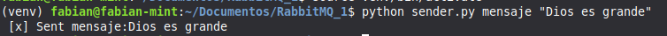
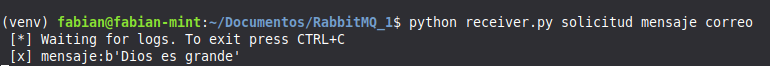

# RabbitMQ con Python - Capítulo 1

Este proyecto demuestra los conceptos básicos de **RabbitMQ** utilizando **Python**, incluyendo el routing de los mensajes mediante exchange y colas

## Requisitos

- Docker
- Python 3.6+
- Biblioteca `pika`

## Instalación

### 1. Ejecutar RabbitMQ con Docker

```bash
# latest RabbitMQ 4.x
docker run -it --rm --name rabbitmq -p 5672:5672 -p 15672:15672 rabbitmq:4-management
```

### 2. Instalar la biblioteca `pika`

```bash
python -m pip install pika --upgrade
```

> **Alternativa:** Si usas un sistema basado en Debian/Ubuntu, puedes buscar el paquete en `apt`.

## Ejecución

### Parte 1: Emisor (`send.py`)

```python
import pika
import sys

connection = pika.BlockingConnection(
    pika.ConnectionParameters(host='localhost'))
channel = connection.channel()

channel.exchange_declare(exchange='direct_logs', exchange_type='direct')

severity = sys.argv[1] if len(sys.argv) > 1 else 'info'
message = ' '.join(sys.argv[2:]) or 'Hello World!'
channel.basic_publish(
    exchange='direct_logs', routing_key=severity, body=message)
print(f" [x] Sent {severity}:{message}")
connection.close()
```

### Parte 2: Receptor (`receive.py`)

```python
#!/usr/bin/env python
import pika
import sys

connection = pika.BlockingConnection(
    pika.ConnectionParameters(host='localhost'))
channel = connection.channel()

channel.exchange_declare(exchange='direct_logs', exchange_type='direct')

result = channel.queue_declare(queue='', exclusive=True)
queue_name = result.method.queue

severities = sys.argv[1:]
if not severities:
    sys.stderr.write("Usage: %s [info] [warning] [error]\n" % sys.argv[0])
    sys.exit(1)

for severity in severities:
    channel.queue_bind(
        exchange='direct_logs', queue=queue_name, routing_key=severity)

print(' [*] Waiting for logs. To exit press CTRL+C')


def callback(ch, method, properties, body):
    print(f" [x] {method.routing_key}:{body}")


channel.basic_consume(
    queue=queue_name, on_message_callback=callback, auto_ack=True)

channel.start_consuming()
```

## Capturas de Pantalla

A continuación, se muestran algunas capturas del proceso:

### 1. Ejecución del script de envío


### 2. Ejecución del script de recepción


